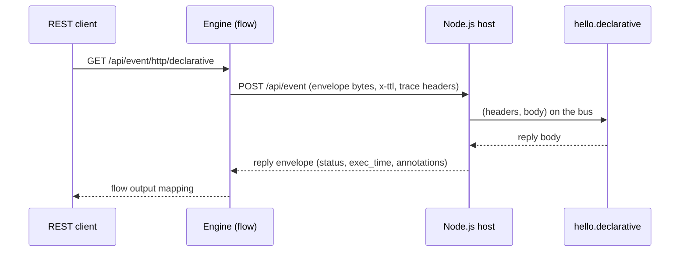

# Join an Event Script Flow

*Join the engines: your function as a first-class flow task.*

> **At a glance**
>
> - **What** — one YAML entry on the engine makes a route remote; the flow itself does
>   not change at all.
> - **Worked demo** — the engine's `composable-example` ships this exact wiring; the
>   demo functions in this repo answer it unchanged.

## The one moving part: the declarative map

On the engine application, enable the map and point the route at your host —
`application.properties`:

```properties
yaml.event.over.http=classpath:/event-over-http.yaml
```

`event-over-http.yaml`:

```yaml
event.http:
  - route: 'hello.declarative'
    target: 'http://${peer.demo.host:127.0.0.1}:${peer.demo.port}/api/event'
    # optional security headers, e.g. an authorization token the host or a
    # gateway validates:
    # headers:
    #   authorization: '${DEMO_PEER_TOKEN:demo}'
```

That is the entire integration surface. Every Event Script task (and MiniGraph
`graph.task`) that names `hello.declarative` now calls your Node.js host. The full map
grammar lives in the engine's
[Event over HTTP guide](https://accenture.github.io/mercury-composable/guides/event-over-http/).

## The flow does not know, and must not care

This is the engine's shipped demo flow — note that nothing in it says "remote" or
"node":

```yaml
flow:
  id: 'event-over-http-declarative'
  description: 'Demonstrate Event-over-Http protocol using declarative means'
  ttl: 10s
  exception: 'v1.hello.exception'

first.task: 'event-over-http-declarative'

tasks:
  - name: 'event-over-http-declarative'
    input:
      - 'input.header -> header'
      - 'input.body -> *'
    process: 'hello.declarative'
    output:
      - 'text(application/json) -> output.header.content-type'
      - 'result -> output.body'
    execution: end
```

Register the route on the Node.js side and the flow executes it:

```javascript
preload('hello.declarative', { instances: 10 }, async (headers, body) => {
  return { body, headers, language: 'node.js' };
});
```

## What your function sees



- **Headers** — the task's `input.header -> header` mapping arrives as your
  `headers` object. Reserved keys are cleaned at ingress, and the flow's business
  correlation id arrives as the read-only `my_correlation_id` header.
- **Body** — whatever the task's input mapping sends (`input.body -> *` passes the
  whole body through).
- **Trace** — the engine's trace id and path ride the wire; `getTrace()` sees them,
  and `annotateTrace()` entries return on the reply envelope into the engine's
  telemetry.

## Errors flow into the flow

- `new AppException(400, "missing 'text'")` in Node.js → a 400 envelope → the flow's
  `exception:` task fires with `error.code=400` and `error.message` exactly as for an
  engine function.
- An unexpected exception → 500 with message and stack.
- The flow's `ttl` bounds the call: on breach the engine receives the standard 408,
  and the exception path decides what happens next — retries and compensation stay in
  the flow, never in Node.js ([Rationale](rationale.md)).

## Checklist

1. Host running and healthy (`/livenessprobe` → `OK`).
2. Route registered (`/info/routes` lists it as `public`).
3. Engine `application.properties` names the map; the map names the route and target.
4. The flow task's `process:` names the route. Nothing else changes.
