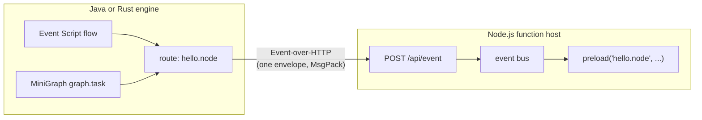

# Externalized functions for Mercury Composable

*Write the function in Node.js. Let the engine orchestrate it.*

> **At a glance**
>
> - **What** — a lightweight Event-over-HTTP **function host and client**: your
>   JavaScript/TypeScript functions become routes a
>   [Mercury Composable](https://accenture.github.io/mercury-composable/) engine calls
>   from Event Script flows and MiniGraph knowledge graphs, exactly as if they were local.
> - **For** teams whose business logic lives in the npm ecosystem — service SDKs,
>   existing Node services, TypeScript domain logic — inside a composable, event-driven
>   architecture.
> - **Not** an orchestrator. Flows, graphs, retries and state live in the engines;
>   this package deliberately provides functions only.

## The main theme, in one screen

Mercury Composable builds applications from **self-contained functions wired by
configuration** — functions never call each other directly; they couple only through
route names and event envelopes. The platform ascends three layers, each documented in
the [engine documentation](https://accenture.github.io/mercury-composable/):

| Layer | Idea | Authority |
|-------|------|-----------|
| **1 — Event-driven** | Functions + route names + `EventEnvelope` over an in-memory event bus | [Event-driven Foundation](https://accenture.github.io/mercury-composable/guides/event-driven/) |
| **2 — Composable** | **Event Script**: YAML flows choreograph functions — orchestration is configuration, not code | [Composable Orchestration](https://accenture.github.io/mercury-composable/guides/event-script/) |
| **3 — Knowledge Graph** | **MiniGraph**: an Active Knowledge Graph *is* the application — graphs execute behavior through skills | [Knowledge Graph](https://accenture.github.io/mercury-composable/guides/knowledge-graph/) |

This site documents the **fourth seat at that table**: functions that live *outside*
the engine — in a Node.js process — yet participate in layers 2 and 3 as first-class
tasks. The seam is [Event over HTTP](https://accenture.github.io/mercury-composable/guides/event-over-http/):
the same event envelope, carried over HTTP, addressed by the same route names.

An engine flow or graph names the route `hello.node`; a one-entry declarative map
points that route at your Node.js host; your function runs with trace context carried
end to end. **No engine code changes. No orchestration in Node.js.**

## Where to go next

- **New here?** [Getting Started](guides/getting-started.md) — a running function in
  five minutes, called from an engine flow.
- **Why this design?** [Rationale](guides/rationale.md) and
  [Design](guides/design.md) — the thinking before the how.
- **Writing functions?** [Function Writing Patterns](guides/function-patterns.md).
- **Wiring the engine?** [Join an Event Script Flow](guides/join-event-script.md) ·
  [Join a Knowledge Graph](guides/join-knowledge-graph.md).
- **You are an AI agent?** Start at the [AI Agent Guide](guides/ai-agent-guide.md) —
  the complete authoring grammar on one page — and the machine index
  [llms.txt](llms.txt).

!!! note "Engine versions"
    Event Script flows call declarative Event-over-HTTP targets on any 4.x engine.
    **MiniGraph `graph.task` targets require engine v4.11.11 or later** (the release
    that taught the deployed-graph guard about the declarative map).
