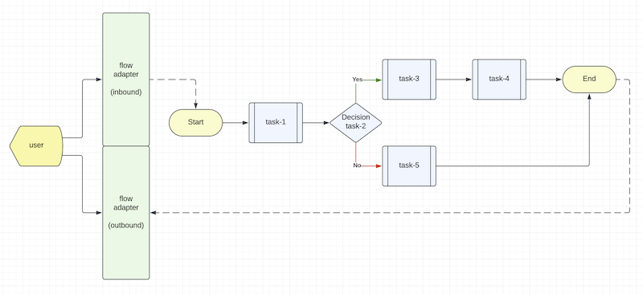

# Writing custom Flow Adapters

## What is a Flow Adapter?

> Figure 1 - Event Flow Diagram



As shown in Figure 1, a transaction flow diagram has a start point and an end point. Each processing step is called
a "task". Some tasks would do calculation and some tasks would make decision to pass to the next steps.

Each task is a composable function that is independent of each other. The system uses a user defined event "flow"
configuration to connect the tasks together to handle a certain use case, query or transaction.

A "Flow Adapter" provides a gateway between the external world and the internal world of a flow connecting the tasks.

## Built-in HTTP Flow Adapter

The system has a built-in "HTTP Flow Adapter" that converts a REST request into an event that is passed to
the first task of a flow. When the flow finishes, the result of the last task will be converted as a REST response
to the HTTP Flow Adapter for onward delivery to the caller.

## Minimal Kafka Flow Adapter

A minimalist Kafka Flow Adapter application is available in
[Composable-example](https://github.com/Accenture/mercury-composable-examples)

Please clone the above example repository and review the subproject "minimalist-kafka-adapter" for details.

The sample Kafka Flow Adapter is written as a demo application for you to visualize how a Kafka Flow Adapter works.

You may update the build script, remove the example "profile" demo classes and compile the project as a reusable
composable library.

*Configurable setup of consumers and producer*

You can define the "topic to task/flow" mapping in the kafka-adapter.yaml file.

For example, the sample kafka-adapter.yaml in the "test" folder tells the system to route inbound messages from the
Kafka topic "hello.world" to the flow "get-profile-kafka" and from the topic "hello.notice" to the task 
"simple.topic.listener". Note that a flow has the "flow://" protocol prefix.

If you need to publish messages to Kafka topics, turn on the producer feature with the "producer.enabled" parameter.

```yaml
consumer:
  - topic: 'hello.world'
    target: 'flow://get-profile-kafka'
    group: 'group-100'
    tracing: true

  - topic: 'hello.notice'
    target: 'simple.topic.listener'
    group: 'group-100'
    tracing: true    

producer.enabled: true
```


*Kafka emulator*

The system can emulate a Kafka server in unit tests. Just turn on the "emulate.kafka" parameter in application.yml 
if you need it.

```yaml
#
# To use Kafka emulator instead of a Kafka cluster or standalone Kafka server,
# set emulate.kafka to true
#
emulate.kafka: true
```

The Kafka emulator is provided as a convenient feature for unit tests. It is not designed as a replacement of a Kafka
broker. The emulation offers a single partition per topic and the offset is monotonically increasing for illustration
purpose only.

Topics are automatically created.

*Kafka helper scripts*

In the "helpers" folder, there are three JavaScript files that are need when you try the minimalist Kafka Flow Adapter
as a main application. Please follow the README file in the minimalist-kafka-adapter subproject to test it.

## Use of worker thread technology

The minimalist Kafka Adapter uses the Node's worker thread feature to encapsulate the KafkaJS library.
This functional isolation runs the KafkaJS library in a sandbox memory space separated from the Kafka Flow Adapter
itself.

Since Kafka is resource intensive, this functional isolation is an architectural best practice.

The following composable function encapsulates a Kafka Worker that runs in a separate "worker thread". The Kafka 
consumers and producer are available as a composable function using the route "kafka.adapter". In this example, 
the `kafka.adapter` serves both inbound and outbound Kafka topics.

```javascript
import { Composable, EventEnvelope, preload } from 'mercury-composable';
import { KafkaWorker } from '../workers/kafka-worker.js';

export class KafkaAdapter implements Composable {

    // Composable worker is configured as an interceptor so its responses are ignored.
    // You can check if the incoming request has a "replyTo" and then send a response accordingly.
    @preload('kafka.adapter', 5, true, true)
    initialize(): Composable {
        return this;
    }

    async handleEvent(evt: EventEnvelope) {
        // deferred startup until triggered by autostart or your own setup task
        if ('start' == evt.getHeader('type')) {
            KafkaWorker.workerBridge();
        }
        // sending the original event to the worker to preserve metadata for tracing and correlation
        KafkaWorker.sendEventToWorker(evt);
        return null;
    }
}
```

## Sample code

The minimalist Kafka Flow Adapter can be used as a template to write your own "Flow Adapters". Some flow adapters
do not need "worker thread" technology for functional isolation if you have control of the underlying dependencies. 
For those libraries that are complex and you have no control over its source code, "worker thread" technology is a 
good choice.

<br/>

|          Chapter-7           |                   Home                    |         Appendix-I          |
|:----------------------------:|:-----------------------------------------:|:---------------------------:|
| [API Overview](CHAPTER-7.md) | [Table of Contents](TABLE-OF-CONTENTS.md) | [Appendix-I](APPENDIX-I.md) |
